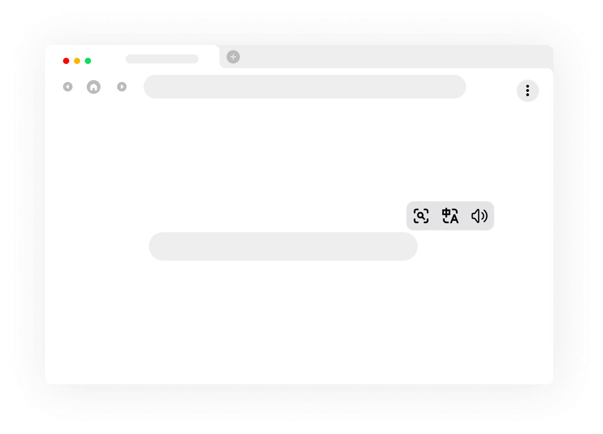
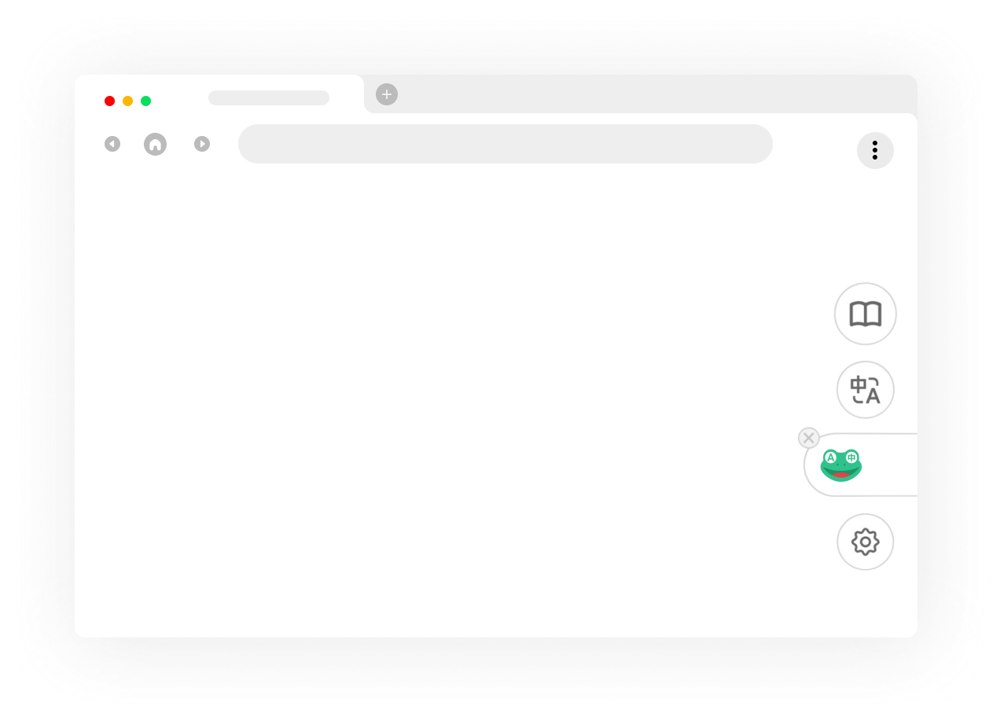

# QQ Frog


QQ Frog is a lightweight, local-first personal fork of Read Frog / 伴讀蛙 for everyday reading and translation.

Traditional Chinese documentation is available in [README.zh-TW.md](./README.zh-TW.md).

## Origin And Purpose

QQ Frog is a personal backup fork based on the original Read Frog browser extension template, known in Chinese as 伴讀蛙. This repository exists for self-use, local experimentation, and preserving a standalone configuration that matches the maintainer's own browsing and translation workflow.

Thanks to the original Read Frog / 伴讀蛙 project and its contributors for the extension foundation, product idea, and implementation patterns this fork builds on.

## Lightweight Version

This fork keeps the extension focused on a small self-use workflow: quick page reading, selection translation, local settings, and optional personal provider configuration.

It deliberately avoids bundled personal credentials and keeps hosted/runtime assumptions minimal.

## Screenshots





## Local-First Defaults

QQ Frog is designed to run as a standalone extension. Runtime service URLs default to localhost, and API keys are entered by the user in the options page rather than bundled into production builds.

The app reference settings in source include provider definitions and example AI actions without personal API keys, custom headers, provider options, or external note-database connections.

## Google Drive Sync

Settings can be synced to the user's Google Drive `appDataFolder` using the Chrome extension OAuth flow.

To enable this in a build, create a Google OAuth client for a Chrome extension and set:

```bash
WXT_GOOGLE_CLIENT_ID=your-google-client-id
```

The extension requests Drive app-data access and the account email used to separate sync metadata.

## Development

```bash
pnpm install
SKIP_FREE_API=true pnpm test
pnpm type-check
pnpm build
```

`SKIP_FREE_API=true` is recommended for local agent validation because `free-api.test.ts` depends on live external translation services.

## Extension Surfaces

- Popup
- Options page
- Side panel
- Translation hub
- Content scripts
- DevTools panel

## Project References

- [Project structure](./docs/project-structure.md)
- [Security review](./docs/audit/security-review.md)
- [Privacy review](./docs/audit/privacy-review.md)
- [Permissions review](./docs/audit/permissions-review.md)
- [Release checklist](./docs/audit/release-checklist.md)

## License And Attribution

This fork is distributed under the GNU General Public License v3.0 only. See [LICENSE](./LICENSE).

Modified from the original Read Frog / 伴讀蛙 browser extension template. Changes in this repository are made for a lightweight personal backup and local self-use version in 2026.
