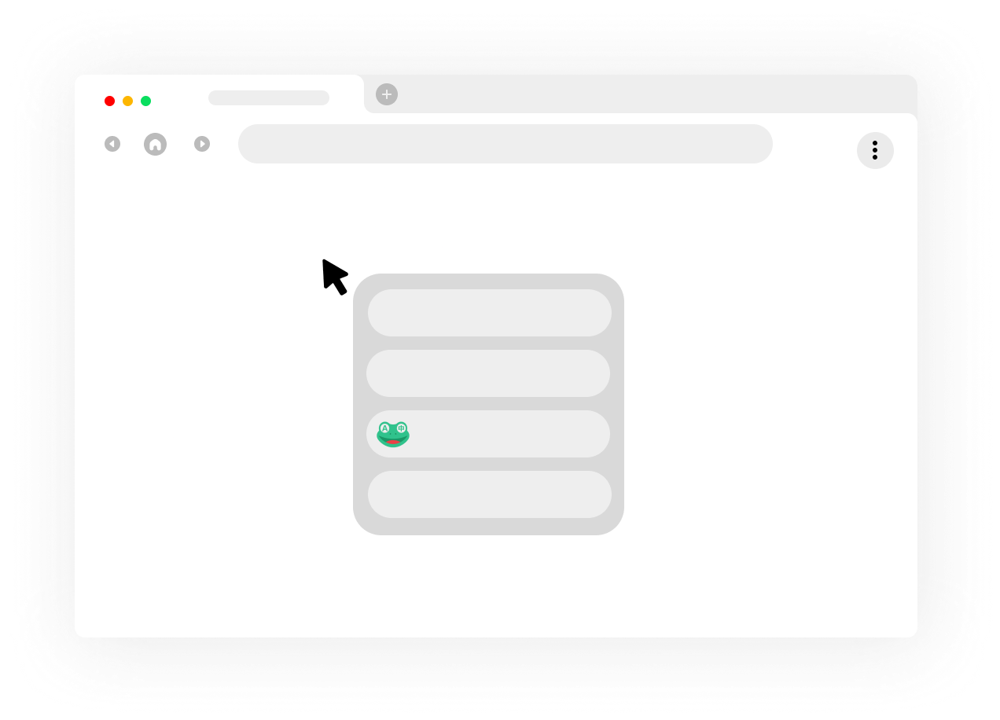

# QQ Frog

  

**輕量化、本機優先的瀏覽器擴充功能，用於日常閱讀、選取翻譯、側邊欄翻譯，以及可選的本機 PDF 翻譯。**

英文主文件請見 [README.md](./README.md)。

[快速開始](#快速開始) · [功能](#功能) · [PDF 翻譯](#pdf-翻譯) · [開發](#開發) · [文件](#文件) · [English](./README.md)

---

## 概覽

QQ Frog 是基於原始 Read Frog 瀏覽器擴充樣板，也就是「伴讀蛙」所建立的個人備份 fork。本專案主要用於自用備份、本機實驗，以及保留符合維護者自身瀏覽與翻譯流程的單機設定。

感謝原始 Read Frog / 伴讀蛙專案與貢獻者提供擴充功能基礎、產品想法與實作模式，讓此 fork 能在其成果上延伸。

---

## 快速開始

```bash
pnpm install
pnpm dev
```

接著開啟 `chrome://extensions`，啟用 **Developer mode**，並載入 WXT 產生的 extension 目錄。

若要使用本機 PDF 翻譯，啟動可選的 bridge service：

```powershell
cd bridge
py -3.11 -m venv ..\.venv-paddleocr
..\.venv-paddleocr\Scripts\python.exe -m pip install --upgrade pip setuptools wheel
..\.venv-paddleocr\Scripts\python.exe -m pip install paddlepaddle -i https://www.paddlepaddle.org.cn/packages/stable/cpu/
..\.venv-paddleocr\Scripts\python.exe -m pip install -r requirements-paddleocr.txt
..\.venv-paddleocr\Scripts\python.exe -m uvicorn server:app --host 127.0.0.1 --port 8001
```

> 注意：安裝 Native Messaging host 時不要照抄 placeholder extension ID。請使用 `chrome://extensions` 顯示的真實 ID。

---

## 功能

此 fork 將擴充功能收斂在實用的本機流程：

| 入口           | 能力                                                  |
| -------------- | ----------------------------------------------------- |
| 選取工具列     | 從任何網頁快速翻譯選取文字                            |
| Popup          | 快速翻譯控制，以及 **更多** 選單中的 PDF 翻譯入口     |
| Side panel     | 在常駐側邊欄中整合翻譯工作臺、影片字幕控制與 PDF 翻譯 |
| Options 設定頁 | Provider 設定、同步設定、完整 PDF bridge 診斷         |
| 本機 bridge    | 可選 PaddleOCR OCR 與依 provider 路由的 PDF 翻譯      |

專案不打包個人憑證，並盡量降低 hosted/runtime 假設。

---

## 畫面與入口




完整介面地圖請見 [介面導覽](./docs/interface-tour.zh-tw.md)。

---

## 本機優先預設

QQ Frog 設計為可單機執行的瀏覽器擴充。Runtime 服務 URL 預設指向 localhost，API keys 由使用者在設定頁輸入，不會打包進 production build。

原始碼中的 App 參考設定只包含提供商定義與範例 AI 動作，不包含個人 API key、自訂 headers、provider options 或外部筆記資料庫連線。

---

## PDF 翻譯

PDF 翻譯是 opt-in 的本機流程：

1. 擴充功能將 PDF 送到本機 bridge service。
2. bridge 使用可選的 PaddleOCR runtime 執行 OCR。
3. 翻譯會依使用者選擇路由到 Chrome 內建 Gemini、LM Studio、OpenAI 或 Gemini API。

PaddleOCR、PaddlePaddle 與 OCR model 檔案不會打包進 extension。只有在使用者選擇本機 PDF OCR 時才需要安裝。請見 [bridge/README.md](./bridge/README.md) 與 [PaddleOCR runtime 分隔說明](./docs/audit/paddleocr-runtime-separation.md)。

PDF 入口：

| 入口                           | 用途                                                    |
| ------------------------------ | ------------------------------------------------------- |
| Options → PDF Translation      | 完整設定、health check、一鍵啟動 bridge、日誌與進階維護 |
| Side panel → PDF Translation   | 在側邊欄中上傳 PDF 並執行翻譯                           |
| Popup → More → PDF Translation | 快速跳轉到 PDF 翻譯設定與流程                           |

---

## Google Drive 同步

設定可透過瀏覽器擴充功能 OAuth flow 同步到使用者個人 Google Drive 的 `appDataFolder`。QQ Frog 不使用 service account，也不使用共用的專案 Drive。

若要在 build 中啟用，請建立 Chrome 擴充功能用的 Google OAuth client，並設定：

```bash
WXT_GOOGLE_CLIENT_ID=your-google-client-id
```

實際使用時，使用者在 options 頁點擊 **連線 Google Drive**。擴充功能會優先使用 `chrome.identity.getAuthToken`，不可用時 fallback 到 `browser.identity.launchWebAuthFlow`，由 Google 顯示帳號選擇與 consent 畫面，讓使用者授權自己的 Google 帳號。

要求的 scopes：

- `https://www.googleapis.com/auth/drive.appdata`：只讀寫此擴充功能自己的隱藏 app-data 檔案 `qq-frog-config.json`。
- `https://www.googleapis.com/auth/userinfo.email`：讀取被選取帳號的 email，讓本機同步 metadata 能偵測帳號是否更換。

OAuth token 只存於 extension local storage，使用者登出 Google Drive 同步時會移除。

---

## 開發

```bash
pnpm install
SKIP_FREE_API=true pnpm test
pnpm type-check
pnpm build
```

本機 agent 驗證建議設定 `SKIP_FREE_API=true`，因為 `free-api.test.ts` 依賴即時外部翻譯服務。

---

## 擴充介面

- Popup
- Options 設定頁
- Side panel
- Translation hub
- Content scripts
- DevTools panel

---

## 文件

- [介面導覽](./docs/interface-tour.zh-tw.md)
- [專案資料夾結構](./docs/project-structure.md)
- [PDF bridge guide](./bridge/README.md)
- [PaddleOCR runtime 分隔說明](./docs/audit/paddleocr-runtime-separation.md)
- [Security review](./docs/audit/security-review.md)
- [Privacy review](./docs/audit/privacy-review.md)
- [Permissions review](./docs/audit/permissions-review.md)
- [Release checklist](./docs/audit/release-checklist.md)

---

## AI 協作開發

此 repository 使用 AI 輔助開發，並由維護者審查。

| Model        | Role                       |
| ------------ | -------------------------- |
| OpenAI Codex | 實作、驗證、文件與審查協調 |

> 免責聲明：AI 產生的變更會在可行範圍內由維護者審查與測試，但不保證其正確性、安全性或適用於任何特定目的。請自行評估風險。

---

## 授權與致謝

此 fork 以 GNU General Public License v3.0 only 授權散布。請見 [LICENSE](./LICENSE)。

本專案修改自原始 Read Frog / 伴讀蛙瀏覽器擴充樣板。此 repository 內的修改是 2026 年為輕量化個人備份與本機自用版本所做。
